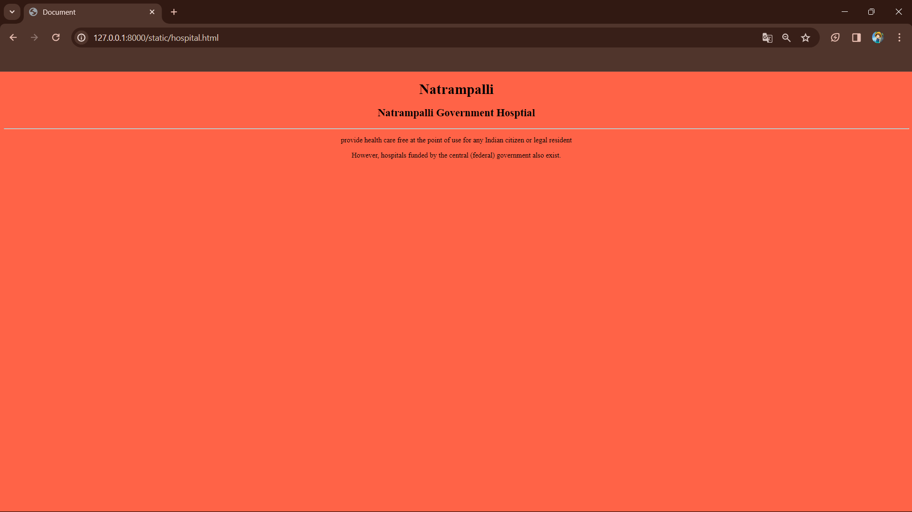
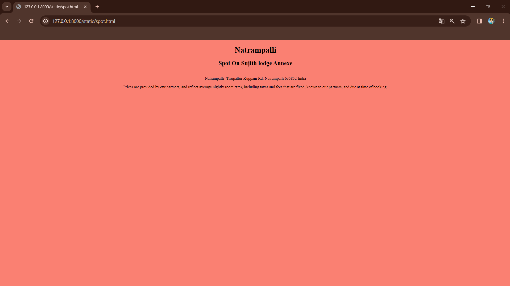
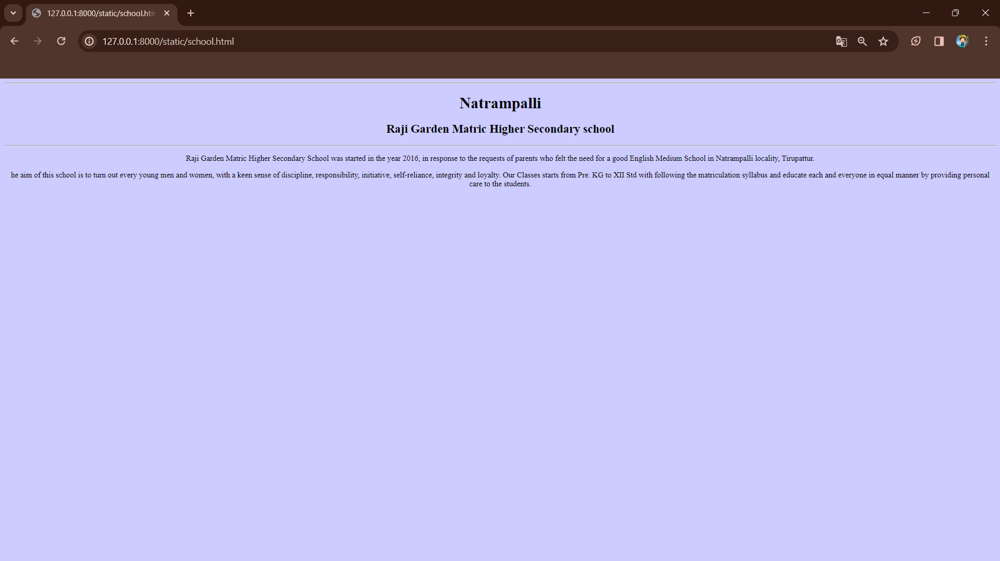
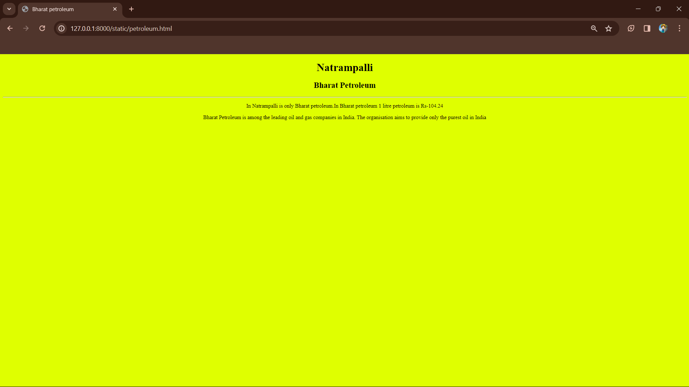
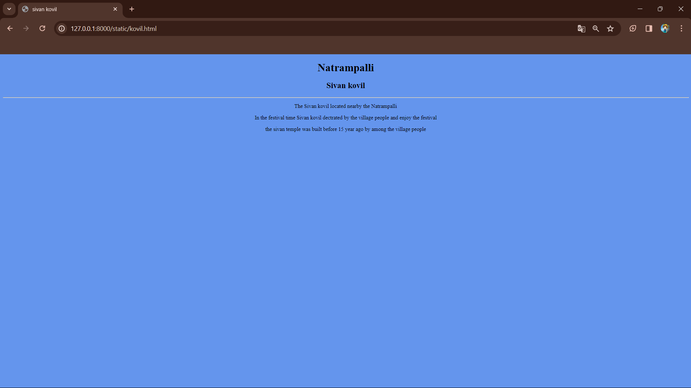

# Ex04 Places Around Me
## Date: 21-3-2024

## AIM
To develop a website to display details about the places around my house.

## DESIGN STEPS

### STEP 1
Create a Django admin interface.

### STEP 2
Download your city map from Google.

### STEP 3
Using ```<map>``` tag name the map.

### STEP 4
Create clickable regions in the image using ```<area>``` tag.

### STEP 5
Write HTML programs for all the regions identified.

### STEP 6
Execute the programs and publish them.

## CODE
## jishnu.html
```
<html >
<head>
    
    <title>jishnu</title>
</head>
<body>
    


<map name="image-map">
    <area target="" alt="Natrampalli Government Hosptial" title="Natrampalli Government Hosptial" href="hosptital.html" coords="948,790,1155,854" shape="rect">
    <area target="" alt="Spot On Sujith lodge Annexe" title="Spot On Sujith lodge Annexe" href="spot .html" coords="1311,623,1487,674" shape="rect">
    <area target="" alt="Raji Garden Matric Higher School" title="Raji Garden Matric Higher School" href="school.html" coords="1509,723,1714,777" shape="rect">
    <area target="" alt="Bharat petroleum  " title="Bharat petroleum  " href="petroleum.html" coords="996,416,1182,467" shape="rect">
    <area target="" alt="Sivan kovil" title="Sivan kovil" href="kovil.html" coords="1444,149,1588,210" shape="rect">
</map>
    
</body>
</html>
```
## hospital.html
```
<!DOCTYPE html>
<html lang="en">
<head>
    <meta charset="UTF-8">
    <meta name="viewport" content="width=device-width, initial-scale=1.0">
    <title>Document</title>
</head>
<body bgcolor="#FA8072"> 

    <h1><center></center> </h1>
    <h2><center></center></h2>
    <hr> 
    <center><p></p></center>
   <center><p> </p></center>
</body>
</html>
```

## spot.html
```
<!DOCTYPE html>
<html lang="en">
<head>
    <meta charset="UTF-8">
    <meta name="viewport" content="width=device-width, initial-scale=1.0">
    <title></title>
</head>
<body bgcolor="#FA8072"> 

    <h1><center>Natrampalli</center> </h1>
    <h2><center>Spot On Sujith lodge Annexe</center></h2>
    <hr> 
    <center><p>Natrampalli -Tirupattur Kuppam Rd, Natrampalli 635852 India</p></center>
   <center><p>Prices are provided by our partners, and reflect average nightly room rates, including taxes and fees that are fixed, known to our partners, and due at time of booking.</p></center>
   
</body>
</html>
```
## school.html
```
<!DOCTYPE html>
<html lang="en">
<head>
    <meta charset="UTF-8">
    <meta name="viewport" content="width=device-width, initial-scale=1.0">
    <title></title>
</head>
<body bgcolor="#FA8072"> 
<hr>
    <h1><center>Natrampalli</center> </h1>
    <h2><center>Raji Garden Matric Higher Secondary school</center></h2>
<hr> 
    <center><p>Raji Garden Matric Higher Secondary School was started in the year 2016, in response to the requests of parents who felt the need for a good English Medium School in Natrampalli locality, Tirupattur.</p></center>
   <center><p>    he aim of this school is to turn out every young men and women, with a keen sense of discipline, responsibility, initiative, self-reliance, integrity and loyalty. Our Classes starts from Pre. KG to XII Std with following the matriculation syllabus and educate each and everyone in equal manner by providing personal care to the students.</p></center>
</body>
</html>
```
## petroleum.html
```
<!DOCTYPE html>
<html lang="en">
<head>
    <meta charset="UTF-8">
    <meta name="viewport" content="width=device-width, initial-scale=1.0">
    <title>Bharat petroleum</title>
</head>
<body bgcolor="#FA8072"> 

    <h1><center>Natrampalli</center> </h1>
    <h2><center>Bharat Petroleum</center></h2>
    <hr> 
    <center><p>In Natrampalli is only Bharat petroleum.In Bharat petroleum 1 litre petroleum is Rs-104.24</p></center>
   <center><p> Bharat Petroleum is among the leading oil and gas companies in India. The organisation aims to provide only the purest oil in India</p></center>
</body>
</html>
```

## kovil.html
```
<!DOCTYPE html>
<html lang="en">
<head>
    <meta charset="UTF-8">
    <meta name="viewport" content="width=device-width, initial-scale=1.0">
    <title>sivan kovil</title>
</head>
<body bgcolor="#6495ED"> 

    <h1><center>Natrampalli</center> </h1>
    <h2><center>Sivan kovil</center></h2>
    <hr> 
    <center><p>The Sivan kovil located nearby the Natrampalli</p></center>
    <center><p>In the festival time Sivan kovil dectrated by the village people and enjoy the festival</p></center>
    <center><p>the sivan temple was built before 15 year ago by among the village people</p></center>
</body>
</html>
```


## OUTPUT

## jishnu.html
.png>)

## Hosptial.html


## spot.html


## School.html


## petroleum.html


## kovil.html


## RESULT
The program for implementing image maps using HTML is executed successfully.
